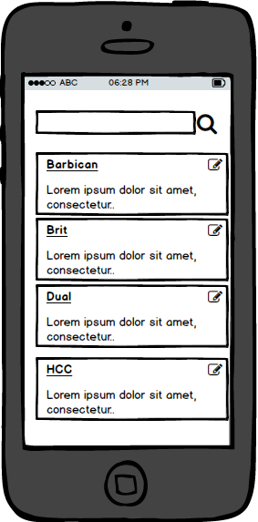

# Sample 04 - Components Layout

Before starting the real code (access to services, binding...) is a good idea to build the pure HTML Layout in the components, this will let us check the look and feel, give the developer and idea of what has to be implemented, and check components that are complex and could be breaking down into subcomponents.

In this sample we will build the login and clients layout. To build this layout we are going to follow a thumb-rule:components that are "page" like will be built using bootstrap grid css, components that are small and likely to be reused, we will use flexbox to build that layout (try to have the lest dependency with external framework 
dependencies).

- First of all we are going to ensure that we are referencing the bootstrap CSS library.

_./webpack.config.js_

```diff
  entry: {
    app: './app/app.ts',
    vendor: [
      'angular',        
      '@uirouter/angularjs',
    ],    
    appStyles: [
+      '../node_modules/bootstrap/dist/css/bootstrap.css',
      './mystyles.scss',       
    ]
  },
```

- Let's start with the login, for this component we will take it easy, just grab a sample from _bootsnnip_ 
and paste it.

_./src/app/components/login/login.html_

```diff
<div>
-    <h1>Hello From Login Component !</h1>
+    <div class="container" style="margin-top:30px">
+        <div class="col-md-4 col-md-offset-4">
+            <div class="panel panel-default">
+                <div class="panel-heading"><h3 class="panel-title"><strong>Sign in </strong></h3></div>
+                    <div class="panel-body">
+                        <form role="form">
+                            <div class="form-group">
+                                <label for="exampleInputEmail1">Username or Email</label>
+                                <input type="email" class="form-control" style="border-radius:0px" id="exampleInputEmail1" placeholder="Enter email">
+                            </div>
+                            <div class="form-group">
+                                <label for="exampleInputPassword1">Password <a href="/sessions/forgot_password">(forgot password)</a></label>
+                                <input type="password" class="form-control" style="border-radius:0px" id="exampleInputPassword1" placeholder="Password">
+                            </div>
+                            <button type="submit" class="btn btn-sm btn-default">Sign in</button>
+                        </form>
+                    </div>
+                </div>
+            </div>
+    </div>    
    <a ui-sref="clients">Navigate to clients</a>
</div>
```

> This component it's a bit complex, as an excercise for the student: it would be a good idea to break it down into three:
loginComponent, loginHeadingComponent, loginBodyComponent, and we could go one step further, creating a reusable FormGroup
subcomponent. 

- Let's test the results:

```cmd
npm start
```

- For the client list we can initially split the page into subcomponents:



```diff
+---client
    \---list
        |   client.list.component.ts
        |   clientlist.html
        |   index.ts
        |
        +---result
        |       client.list.card.component.html
        |       client.list.card.component.ts
        |       client.list.result.component.html
        |       client.list.result.component.ts
        |
        \---search
               client.list.search.component.ts
               client.list.search.component.html
```

> Later on it would be a good idea and add a refactor, client.list.component, should be named client.list.page?and another possible improvement could be to move to a page folder all the components that are just pages.

- Let's start by creating clientListSearch:

> Let's discuss here about naming, should we take it simpler? What's your take on this?

_./src/app/components/client/list/search/client.list.search.component.html_

```html
<div class="input-group">
  <input type="text" 
         class="form-control" 
         placeholder="Search"         
         />
    
  <span class="input-group-btn"> 
    <button class="btn btn-primary" type="button">
        <i class="glyphicon glyphicon-search"></i>
    </button>
  </span>
</div>
```

_./src/app/components/client/list/search/client.list.search.component.ts_

```javascript
export const ClientListSearchComponent = {
  template: require('./client.list.search.component.html') as string
};
```

- Let's register it in the list modules.

_./src/app/components/client/list/index.ts_

```diff
import * as angular from 'angular';
import { ClientListComponent } from './client.list.component';
+ import { ClientListSearchComponent } from './search/client.list.search.component';

export const ClientListModule = angular.module('clientlist', [
  ])
  .component('clientlist', ClientListComponent)
+  .component('clientlistsearchcomponent', ClientListSearchComponent)
;
```
- let's use it in our client.list.html

_./src/app/components/client/list/clientlist.html_

```diff
<div>
-    <h1>Hello From Client Component !</h1>
+    <clientlistsearchcomponent></clientlistsearchcomponent>  
</div>
```

- For the clients list we will build this layout using flexbox (we will cheat here and add as well some bootstrap
css, in a real project we will avoid this and use CSS modules like approach + SASS for the theming).

_./src/app/components/client/list/result/client.list.result.component.html_

```html
<div style="display:flex;flex-direction:row">
  <div class="panel panel-default" style="height: 80px">
     <a href="/#">My sport dealer</a>
     <span>Lorem ipsum dolor sit amet, consectetur.. </span>
  </div>
  <div class="panel panel-default" style="height: 80px">
     <a href="/#">We Run</a>     
     <span>Lorem ipsum dolor sit amet, consectetur.. </span>
  </div>   
</div>
```

_./src/app/components/client/list/result/client.list.result.component.ts_

```javascript
export const ClientListResultComponent = {
  template: require('./client.list.result.component.html') as string
};
```

- Let's register it

_./src/app/components/client/list/index.ts_

```diff
import * as angular from 'angular';
import { ClientListComponent } from './client.list.component';
import { ClientListSearchComponent } from './search/client.list.search.component';
+ import { ClientListResultComponent } from './result/client.list.result.component';

export const ClientListModule = angular.module('clientlist', [
  ])
  .component('clientlist', ClientListComponent)
  .component('clientlistsearchcomponent', ClientListSearchComponent)
+  .component('clientlistresultcomponent', ClientListResultComponent)  
;
```

- And let's use it

_./src/app/components/client/list/clientlist.html_
```diff
<div>
  <clientlistsearchcomponent></clientlistsearchcomponent>  
+  <clientlistresultcomponent></clientlistresultcomponent>
</div>
```

- Let's check that we get the components displayed.

```cmd
npm start
```

- Checking this layout, we can see that in reality we are talking here about two components, let's chop it into
two: ClientListResultComponent and ClientCardComponent, now it's time to expose properties on the ClientCardComponent. 


_./src/app/components/client/list/result/client.list.card.component.html_

```html
  <div class="panel panel-default" style="height: 80px">
     <a href="/#">My sport dealer</a>
     <span>Lorem ipsum dolor sit amet, consectetur.. </span>
  </div>
```

_./src/app/components/client/list/result/client.list.card.component.ts_

```javascript
export const ClientListCardComponent = {
  bindings: {
    client: '<',
    details: '<',
  },  
  template: require('./client.list.card.component.html') as string,
  controllerAs: 'vm'
};
```

- Time to jump back to the template and add the bindings

_./src/app/components/client/list/result.client.list.card.component.html_

```diff
  <div class="panel panel-default" style="height: 80px">
-     <a href="/#">My sport dealer</a>        
+     <a href="/#">{{vm.client}}</a>
-     <span>Lorem ipsum dolor sit amet, consectetur.. </span>     
+     <span>{{vm.details}}</span>
  </div>
```


- Let's register this new component

_./src/app/components/client/list/index.ts_

```diff
import * as angular from 'angular';
import { ClientListComponent } from './client.list.component';
import { ClientListSearchComponent } from './search/client.list.search.component';
import { ClientListResultComponent } from './result/client.list.result.component';
+ import { ClientListCardComponent } from './result/client.list.card.component';

export const ClientListModule = angular.module('clientlist', [
  ])
  .component('clientlist', ClientListComponent)
  .component('clientlistsearchcomponent', ClientListSearchComponent)
  .component('clientlistresultcomponent', ClientListResultComponent)
+  .component('clientlistcardcomponent', ClientListCardComponent)  
;
```

- Let's use in on client.list.result.component (right now using harcoded data)

_./src/app/components/client/list/result/client.list.result.component.html_

```diff
<div style="display:flex;flex-direction:row">
+  <clientlistcardcomponent client="'My sport dealer'" details="'Lorem ipsum dolor sit amet, consectetur..'"></clientlistcardcomponent>
-  <div class="panel panel-default" style="height: 80px">
-     <a href="/#">My sport dealer</a>
-     <span>Lorem ipsum dolor sit amet, consectetur.. </span>
-  </div>

+  <clientlistcardcomponent client="'We Run'" details="'Lorem ipsum dolor sit amet, consectetur..'"></clientlistcardcomponent>
-  <div class="panel panel-default" style="height: 80px">
-     <a href="/#">We Run</a>     
-     <span>Lorem ipsum dolor sit amet, consectetur.. </span>
-  </div>   
</div>
```

> Note down the "' used (just to avoid referencia a scope variable, rewind back to card component and check vm. stuff)


- If we run the project the same result as before will be displayed but now we have a more maintanable structure.

```cmd
npm start
```

- Duplicates angular:

https://github.com/webpack/webpack/issues/6598

```diff
module.exports = {
  context: path.join(basePath, 'src'),
  resolve: {
    extensions: ['.js', '.ts'],
  },
+  optimization: {
+    runtimeChunk: 'single'
+  },
  entry: {

```
